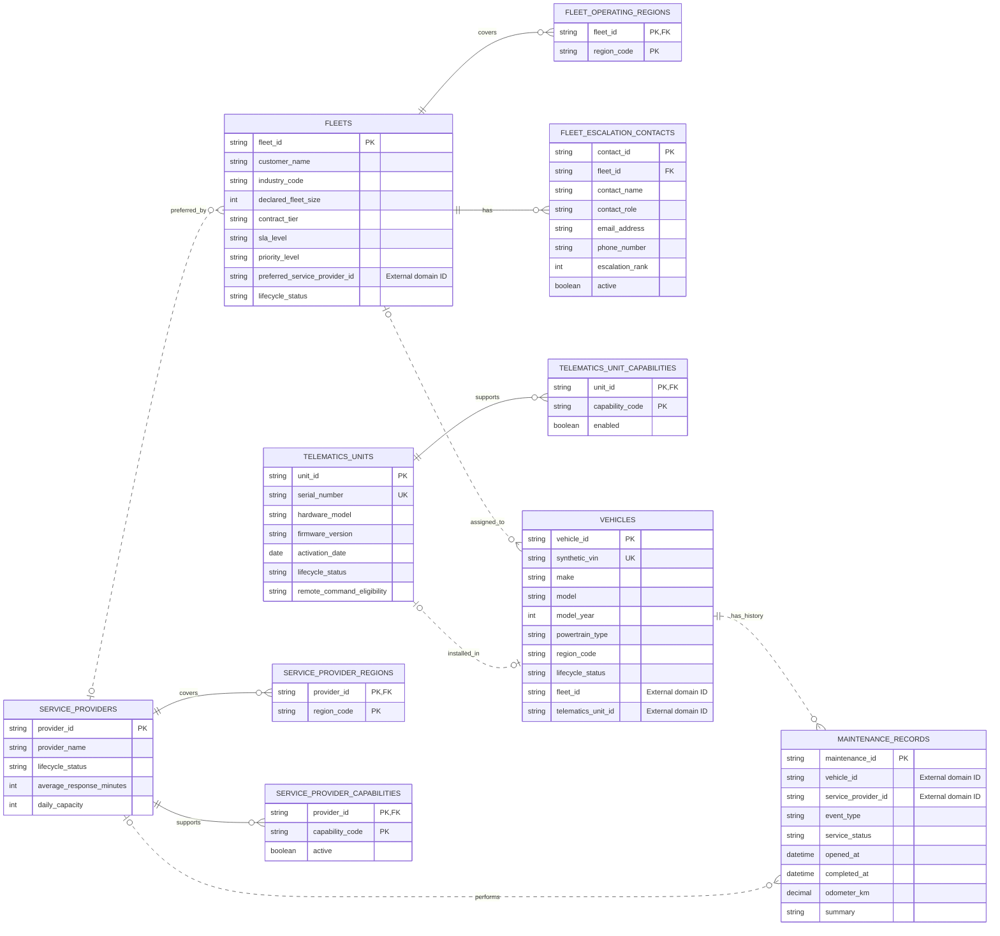

# FleetOps AI Control Lab Architecture

**Initiative:** FleetOps AI Control Lab  
**Version:** 0.1 | **Status:** Draft  
**Author:** Project Team | **Date:** 2026-08-21

> A BDAT view of the target architecture for a synthetic telematics command-center lab. The design demonstrates governed agentic AI, independently owned domain services, streaming operational data, and bounded action. All data and business scenarios are synthetic.

---

## 1. Business Architecture

### 1.1 Capability Map

- Synthetic fleet and vehicle administration — New
- Telematics event ingestion and normalization — New
- Operational digital-twin maintenance — New
- Vehicle exception triage — New
- Contextual risk and SLA prioritization — New
- Playbook and prior-incident retrieval — New
- Evidence-backed action recommendation — New
- Policy enforcement and human approval — New
- Bounded low-risk action execution — New
- Audit, evaluation, and incident learning — New

### 1.2 Key Processes / Value Streams

The primary value stream moves an operational signal from observation to governed action:

1. Generate and ingest a synthetic vehicle event.
2. Validate and normalize the event, then update the operational digital twin.
3. Detect an exception and retrieve vehicle, fleet, policy, maintenance, and incident context.
4. Classify severity and prioritize business impact.
5. Produce a recommendation with evidence, confidence, and alternatives.
6. Apply policy and tool-call guardrails.
7. Execute an eligible low-risk action or route the recommendation for human approval.
8. Record the decision, action, outcome, and evaluation evidence.

### 1.3 Business Services

| Business Service | Description | Consumers |
|---|---|---|
| Fleet Context | Provides authoritative vehicle, device, fleet, provider, and maintenance context. | Agents, operations users, digital twin |
| Event Triage | Classifies incoming events and identifies operational exceptions. | Agent orchestrator, operations users |
| Operational Prioritization | Ranks exceptions using safety, criticality, recurrence, and SLA exposure. | Operations users, triage workflow |
| Recommendation | Proposes supported actions, alternatives, risks, and required approval. | Operations users, policy gate |
| Approval and Control | Enforces action policy and captures human decisions for higher-risk work. | Reviewers, execution service |
| Bounded Execution | Performs only allow-listed mock operational actions. | Agent orchestrator, operations systems |
| Incident Learning | Captures outcomes for evaluation, regression testing, and pattern discovery. | AI engineering, operations leadership |

### 1.4 Gap Analysis

| Capability / Process | Baseline State | Target State | Gap | Priority |
|---|---|---|---|---|
| Master data | Initial domain schemas and service outlines exist. | Independently deployed services with versioned contracts and synthetic records. | Service implementations, APIs, migrations, and seed pipelines. | H |
| Event-to-decision flow | Strategy is documented. | Traceable workflow from ingestion through recommendation. | Stream processing, orchestration, and digital-twin implementation. | H |
| Governed action | Approval and policy behavior is defined conceptually. | Enforced risk tiers, approvals, idempotent actions, and audit evidence. | Policy engine, approval UI, and action adapters. | H |
| Incident learning | Desired outcomes and metrics are identified. | Repeatable evaluation datasets and feedback-driven improvement. | Outcome capture, eval harness, and reporting. | M |

---

## 2. Data Architecture

### 2.1 Conceptual Data Model

The following ER diagram reflects the initial master-data migrations. Solid lines are physical foreign keys contained within one service database. Dotted lines are logical cross-domain references stored only as opaque IDs; they are not database foreign keys.

Live telemetry, current odometer, connectivity, heartbeat, location, alerts, and calculated health are intentionally excluded. They belong to the Telematics Event and Digital Twin domains rather than master data.

### 2.2 Data Entities & Ownership

| Data Entity | Description | System of Record | Data Owner |
|---|---|---|---|
| Vehicle | Stable vehicle identity, specifications, lifecycle, and assignment reference IDs. | Vehicle Master database | Vehicle Master service |
| Telematics Unit | Device identity, firmware inventory, capabilities, and eligibility flags. | Telematics Unit Master database | Telematics Unit Master service |
| Fleet | Synthetic customer/fleet identity, contract tier, SLA, priority, regions, and contacts. | Fleet Master database | Fleet Master service |
| Maintenance Record | Append-oriented vehicle service and maintenance history. | Maintenance History database | Maintenance History service |
| Service Provider | Provider identity, coverage, capabilities, response target, and capacity. | Service Provider Master database | Service Provider Master service |
| Vehicle Event | Immutable synthetic telemetry or operational event. | Telematics Event store | Telematics Event service |
| Vehicle Operational State | Latest derived state and active conditions for a vehicle. | Digital Twin state store | Digital Twin Context service |
| Policy / Playbook | Rules, action eligibility, approval requirements, and procedures. | Policy and knowledge repositories | Policy and Playbook service |
| Incident / Outcome | Prior incidents, resolutions, decisions, and learning evidence. | Incident history store | Incident Learning service |
| Approval / Audit Record | Human decisions and traceable tool/action activity. | Approval and audit stores | Approval and Audit services |

### 2.3 Data Flow & Lineage

- Synthetic generators create master data through service-owned import commands or APIs; direct cross-domain database writes are prohibited.
- The event simulator publishes vehicle events to the ingestion boundary. Validated events are retained and used to update the digital twin.
- Master-data services publish versioned domain-change events using an outbox pattern. Consumers may maintain explicitly non-authoritative projections.
- The MCP/UCP context facade resolves opaque IDs through service APIs and composes responses in memory. It does not create a shared master-data database.
- Recommendations retain source references, model/configuration versions, confidence, policy results, and tool-call identifiers for lineage.
- Approval, execution, and final incident outcomes append to the audit trail and feed evaluation datasets.

### 2.4 Governance & Quality

- Classification: Internal synthetic data. No real customer, employee, driver, vehicle, or employer-derived data is permitted.
- Ownership: Each bounded context is authoritative only for its own entities and migration history.
- Referential integrity: Enforced with foreign keys inside a service database; cross-domain references are validated through contracts or events and tolerate missing/retired IDs.
- Quality controls: Schema constraints, unique synthetic identifiers, stable prefixed IDs, timestamps, source versions, event-schema validation, and synthetic referential-integrity checks.
- Retention: Configuration is required per data class; audit and evaluation evidence should be retained longer than transient telemetry for reproducibility.
- Privacy and security: Avoid personal data by design, use least-privilege service credentials, encrypt transport/storage, and redact sensitive values from logs.

### 2.5 Gap Analysis

| Data Domain | Baseline State | Target State | Gap | Priority |
|---|---|---|---|---|
| Master data | Five PostgreSQL initial migrations are defined. | Independent databases with controlled synthetic data and domain events. | Migration runner, seed generator, contract validation, and automated integrity tests. | H |
| Operational state | Fields and streams are described in the overview. | Queryable digital twin with freshness and provenance. | State schema, update logic, reconciliation, and expiry rules. | H |
| Knowledge and incidents | Content types are identified. | Searchable, cited corpus and reproducible incident dataset. | Document schemas, chunking/indexing, versioning, and seed content. | M |
| Audit and evaluation | Required evidence is identified. | Immutable trace chain connecting event, context, decision, approval, action, and outcome. | Canonical correlation IDs, retention rules, and evaluation schema. | H |

---

## 3. Application Architecture

### 3.1 Application Portfolio

The service-folder catalog and current high-level operation signatures are maintained in [`services/README.md`](services/README.md). These contracts intentionally remain transport- and implementation-neutral at this stage.

| Application | Purpose | Disposition | Owner |
|---|---|---|---|
| Master Data Services | Independently own vehicle, device, fleet, provider, and maintenance data. | New | Domain service owners |
| Telematics Event Service | Ingests, validates, stores, and queries synthetic events. | New | Telemetry domain |
| Digital Twin Context Service | Maintains and exposes derived operational state. | New | Operations context domain |
| Policy and Playbook Service | Retrieves procedures and determines action/approval rules. | New | Governance domain |
| Incident Search Service | Finds comparable historical incidents and outcomes. | New | Incident learning domain |
| Agent Orchestrator | Coordinates triage, context, prioritization, recommendation, and controls. | New | AI platform |
| Approval Interface | Presents evidence and captures reviewer decisions. | New | Operations experience |
| Execution Adapters | Perform only allow-listed mock operational actions. | New | Operations automation |
| Audit and Evaluation Services | Capture traces, evaluate behavior, and expose quality metrics. | New | AI platform / governance |

### 3.2 Integration View

- MCP-style tools expose agent-safe operations; the UCP facade provides a consistent logical context interface.
- Versioned HTTP or gRPC contracts support synchronous domain lookups.
- An event bus supports telemetry ingestion and asynchronous domain-change notifications.
- The orchestrator invokes specialized skills but passes every proposed action through validation and policy gates.
- Cross-service workflows use correlation IDs, timeouts, explicit partial-result handling, and idempotency keys for actions.
- No service reads or writes another service's database.

### 3.3 Application Services

| Application Service | Description | Exposed Via | Consumers |
|---|---|---|---|
| Vehicle Profile | Returns authoritative vehicle identity and external assignment IDs. | API / MCP | Context facade, agents |
| Fleet Profile and SLA | Returns fleet, contract tier, priority, regions, and escalation context. | API / MCP | Context facade, prioritization |
| Telematics Event Query | Returns events, alerts, connectivity, and diagnostic history. | API / MCP / Event | Digital twin, triage, agents |
| Operational State | Returns current vehicle/fleet state and downstream impact. | API / MCP | Context facade, prioritization |
| Knowledge Retrieval | Returns cited policy, playbook, and prior-incident evidence. | API / MCP | Recommendation and policy skills |
| Risk Scoring | Produces score, urgency, factors, and confidence. | API / MCP | Agent orchestrator |
| Approval | Creates requests and captures approval outcomes. | API / Event | Policy gate, reviewers |
| Bounded Action | Executes allow-listed actions after policy verification. | API / Event | Agent orchestrator |
| Audit | Records decisions, tool calls, approvals, actions, and outcomes. | Event / API | Governance, evaluation, dashboard |

### 3.4 Gap Analysis

| Application / Domain | Baseline State | Target State | Gap | Priority |
|---|---|---|---|---|
| Domain services | Boundaries, operations, and schemas are outlined. | Deployable services with tested contracts. | Runtime implementation and integration tests. | H |
| Agent workflow | Skills and responsibilities are specified. | Deterministic orchestration with structured outputs and fallbacks. | Orchestrator, prompts, schemas, and error handling. | H |
| Human approval | Outcomes and restricted actions are defined. | Usable evidence-first review workflow. | Approval API, UI, identity, and notifications. | H |
| Retrieval | Sources and expected outputs are identified. | Grounded retrieval with citations and confidence. | Ingestion, indexing, relevance tests, and provenance. | M |

---

## 4. Technology Architecture

### 4.1 Technology Platforms

The exact cloud and runtime products remain implementation decisions. Initial standards are intentionally portable.

| Platform / Layer | Technology | Deployment Model | Notes |
|---|---|---|---|
| Compute | Containerized services and workers | Local first; cloud-portable | One independently deployable workload per bounded context. |
| Data Storage | PostgreSQL per service | Separate logical database and credential per service | Current migrations target PostgreSQL; no shared tables or cross-database foreign keys. |
| Streaming | Event broker, product to be selected | Local container; managed equivalent later | Telemetry streams, domain events, retries, and dead-letter handling. |
| Knowledge Retrieval | Document store plus vector index, products to be selected | Local first; managed equivalent later | Stores synthetic playbooks and prior incidents with source/version metadata. |
| Integration | Versioned API contracts plus MCP/UCP adapters | Service-to-service | Synchronous composition and agent-safe tools. |
| Observability | OpenTelemetry-compatible logs, metrics, and traces | Shared platform with per-service telemetry | Correlation IDs span event, agent, tool, approval, and action flows. |
| Delivery | Automated build, test, migration, and deployment pipeline | Environment promotion | Migrations are owned and applied by their corresponding service. |

### 4.2 Deployment / Environment View

- Local development hosts independently runnable services, one PostgreSQL database per master-data domain, the event broker, synthetic generators, and observability tooling.
- Test environments use isolated databases and deterministic synthetic datasets for integration and evaluation runs.
- A future hosted environment should separate ingress, application workloads, data services, and operations access using least-privilege identities and network policies.
- Configuration and secrets are externalized per environment; no credentials or real operational data belong in the repository.
- Service health includes liveness, readiness, dependency status, and consumer lag where applicable.

### 4.3 Non-Functional Requirements

These are initial MVP targets and should be validated with load and failure testing.

| NFR Category | Requirement | Initial Target |
|---|---|---|
| Availability | Context and control services remain usable during single-service degradation. | 99.9% service availability; partial context is explicit |
| Performance | Master-data lookup excluding downstream composition. | p95 under 300 ms |
| End-to-end decision latency | Normal event to recommendation under nominal load. | p95 under 5 seconds |
| Scalability | Support the documented MVP with headroom for burst testing. | 100 vehicles initially; horizontal consumers |
| Recoverability | Restore authoritative domain data and replay events. | RPO 15 minutes; RTO 4 hours |
| Security | Authenticate service/tool calls and restrict actions by policy. | Least privilege, encrypted transport, auditable identities |
| Safety | Prevent unapproved high-risk or blocked actions. | 100% policy-gate enforcement in safety evals |
| Traceability | Correlate inputs, context, recommendation, approval, and action. | 100% of agent runs carry a correlation ID |

### 4.4 Gap Analysis

| Platform / Component | Baseline State | Target State | Gap | Priority |
|---|---|---|---|---|
| Runtime platform | No runtime has been scaffolded. | Repeatable local and hosted deployments. | Runtime selection, containers, configuration, and service discovery. | H |
| PostgreSQL | Initial schema scripts exist. | Automated provisioning, migration, backup, and restore per domain. | Database automation and operational runbooks. | H |
| Event platform | Required patterns are defined conceptually. | Durable streams with replay, retry, and dead-letter handling. | Product selection, schemas, and consumers. | H |
| Observability | Required evidence and metrics are listed. | End-to-end traces, dashboards, alerts, and eval reporting. | Instrumentation and telemetry platform configuration. | M |
| Security | Guardrail intent is documented. | Authenticated services, authorization policies, secrets management, and audit controls. | Threat model and control implementation. | H |

---

## Consolidated Gap Summary

| Domain | Gap | Priority | Depends On |
|---|---|---|---|
| Business | Implement the event-to-governed-action operating workflow. | H | Domain services, orchestration, approval |
| Data | Provision isolated stores and complete operational, knowledge, and audit schemas. | H | Database and event-platform automation |
| Application | Build tested service contracts, agent workflow, policy gate, and bounded actions. | H | Runtime standards, synthetic datasets |
| Technology | Establish repeatable environments, streaming, security, and observability. | H | Platform selection and delivery pipeline |

## Architecture Decisions and Constraints

- The repository uses synthetic data only and must not contain employer-derived code, data, APIs, or business rules.
- Each bounded context owns its database; data is disjoint and other domains refer to it only by opaque IDs.
- Cross-domain integrity is eventual and contract-driven, not enforced through database foreign keys.
- Live operational measurements are separated from master data.
- Agent outputs are advisory until validated by policy; high-risk actions require human approval and blocked actions cannot execute.
- The MCP/UCP layer is an integration facade, not a new system of record.
- Product-specific platform choices remain open until implementation requirements and local-development constraints are validated.
